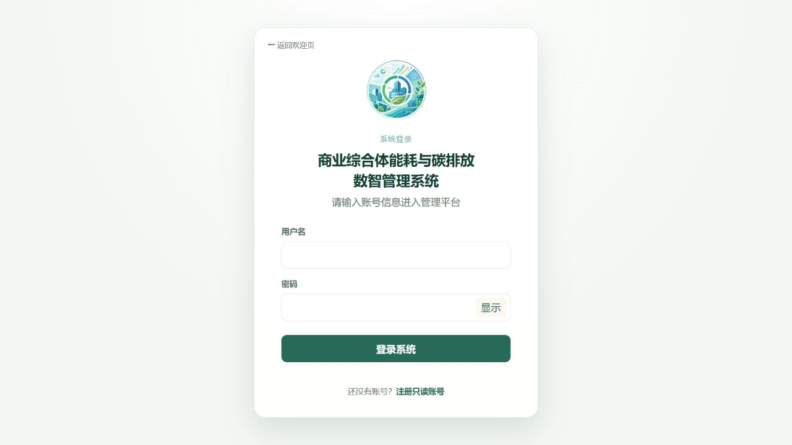
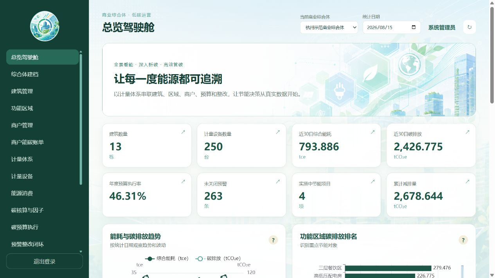

# 商业综合体能耗与碳排放数智管理系统

基于 Java Web 与 MySQL 8 的商业综合体能碳管理系统。系统覆盖综合体建档、空间与商户、分级计量、能源消费、碳核算、碳预算、预警整改、节能项目、商户账单、月度报告、数据质量和统计分析。

## 技术栈

Java 17、Maven 3.9、WAR、Tomcat 10.1、Jakarta Servlet、JSP、JDBC、MySQL 8、BCrypt、Jackson、原生 JavaScript 与 ECharts。

## 功能与截图

- 八个正式示例商业综合体及完整业务数据链。
- 用户登录、普通用户自助注册、Session 认证和角色权限。
- 注册用户固定获得 `registered_user` 普通只读角色。
- 数据库视图、函数、存储过程和触发器驱动的业务处理。
- `/api/health` 同时检查 Web 应用和数据库连接。

## 本地部署

1. 安装 JDK 17、MySQL 8 和 Tomcat 10.1。
2. 按 [本地部署文档](docs/deployment.md)初始化课程数据库。
3. 将 `src/main/resources/db.properties.example` 复制为 `db.properties`，填写本机配置。真实文件已被 Git 忽略且不会进入 WAR。
4. 本地 HTTP 开发设置环境变量 `SESSION_COOKIE_SECURE=false`。
5. 执行 `mvnw.cmd test` 和 `mvnw.cmd clean package`。
6. 将 `target/commercial-complex-carbon.war` 部署到 Tomcat。

## Railway 部署

仓库根目录已经包含多阶段 `Dockerfile`、`railway.toml`、一次性数据库初始化脚本和完整云数据库基线。部署时创建一个 Railway MySQL 服务和一个来自本 GitHub 仓库的 Web 服务，使用 Railway 私有网络变量连接，不要为 MySQL 开启公网 TCP 代理。

完整操作见 [Railway 部署指南](docs/railway-deployment.md)。Web 服务第一次启动时导入 `database/cloud/railway_init.sql` 并创建管理员；迁移成功后，后续重新部署只读取 `schema_migration_history` 并跳过初始化，不会重置用户或业务数据。

## 环境变量

| 变量 | 必填 | 说明 |
| --- | --- | --- |
| `DB_HOST` | 是 | MySQL 私网主机；也兼容 `MYSQLHOST` |
| `DB_PORT` | 是 | MySQL 端口；也兼容 `MYSQLPORT` |
| `DB_NAME` | 是 | 数据库名；也兼容 `MYSQLDATABASE` |
| `DB_USER` | 是 | 数据库用户；也兼容 `MYSQLUSER` |
| `DB_PASSWORD` | 是 | 数据库密码；也兼容 `MYSQLPASSWORD` |
| `ADMIN_USERNAME` | 首次部署必填 | 初始管理员用户名，4-64 位安全字符 |
| `ADMIN_INITIAL_PASSWORD` | 首次部署必填 | 初始管理员密码，至少 12 位且不能使用常见默认值 |
| `SESSION_COOKIE_SECURE` | 生产建议 | Railway 保持 `true`；仅本地 HTTP 使用 `false` |
| `PORT` | Railway 提供 | Tomcat 监听端口，无需手工填写 |

示例键名见 `.env.example`。不得提交 `.env`、真实数据库配置或管理员密码。

## 数据声明

仓库中的能耗、成本、排放、预算、预警、项目和联系信息均为程序生成的示例数据，不代表任何真实企业或个人，也不构成正式碳核证或可交易碳资产。公开仓库不提供管理员密码。

## 开源与安全

项目采用 [MIT License](LICENSE)。贡献方式见 [CONTRIBUTING.md](CONTRIBUTING.md)，安全问题报告方式见 [SECURITY.md](SECURITY.md)。
